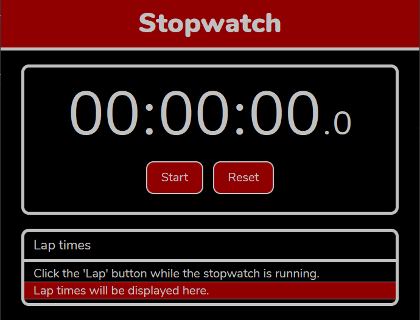

# Simple Stopwatch
This website is a contains a simple stopwatch that is written in JavaScript. The whole point of this project was to practice the skills learned coding in JavaScript. In addition, to further develop knowledge of HTML and CSS.

The project was developed offline and then uploaded to GitHub later.

To see the site in action, got to [freetimefm.github.io/Simple-Stopwatch/](https://freetimefm.github.io/Simple-Stopwatch/ "This will take you to a dedicated GitHub page.").

The self-adjusting timer is provided by [Leon Williams](https://stackoverflow.com/a/44337628 "Stack Overflow thread.").

Want to use this code? [Read the license](LICENSE "MIT License").

---

## Features
So, what can this stopwatch do?  
- To start, it can count the time elapsed to *(what I believe)* is pretty good accuracy.
- The webpage has a responsive layout to adapt to smaller screens.
- It can record lap times and display them in a legible format.
- An accurate timer that doesn't drift.
- The time difference of the recorded lap time and a previously recorded lap time will be displayed.

Basically, the normal functionaity of a typical stopwatch.  

The first unit of the stopwatch display is the Hour, then the minute unit, then the second unit followed lastly by the deci-second unit.

The list of lap times will display an index followed by the recorded time and then the difference between the previous time.

---

## Instructions
To start the stopwatch click the *'Start'* button. While it is running, click the *'Lap'* button to record a specific time. The lap time will be displayed in the list below the stopwatch display. To stop, click the *'Stop'* button. The *'Start'* button will resume the counting while the *'Reset'* button will reset the display as well as the lap times displayed.

---

## Extra Functionality
You can get and the time elapsed in deci-seconds (one-tenth of a second) and seconds. This is done in the JavaScript console.  

To get time in deci-seconds, type `sw.duration`.  
To set, type `sw.duration = [value]`, where `[value]` is a positive integer.  
Ex. `sw.duration = 100` which set the stopwatch to 10 seconds.

To get time in seconds, type `sw.durationInSeconds`.  
To set, type `sw.durationInSeconds = [value]`, where `[value]` is a positive integer.  
Ex. `sw.durationInSeconds = 10` which set the stopwatch to 10 seconds.

---

## Todo List
- [ ] Format lap times from ugly list to a neat table.
- [ ] Update all js code to ES6 standards.
- [ ] Refine CSS.

---

## Screenshots

